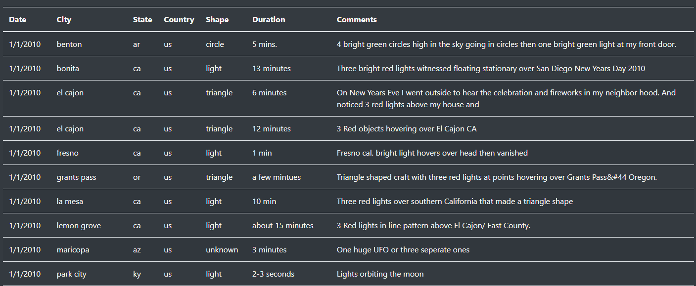

# Module 11: UFOs

### Overview
Dana’s webpage and dynamic table are working as intended, but she’d like to provide a more in-depth analysis of UFO sightings by allowing users to filter for multiple criteria at the same time.

### Goal
Goal is too add more filtering capabilities to our webpage. city, state, country, and shape table filters will be added.

### Result
All the filters are added per challenge requirement. when the page loads, all the data is visible per **image0**.  
   
**Image0**: shows the table as loaded.  

**Image1** shows the created filters. There are 5 fields that can be used to filter the data. 
  
**Image1**: 5 filters to narrow down the data  
As can be seen in **image1**, all the filters are prefilled with examples. As soon as data is changed, the filtering is applied to the data.    

**Image2** shows an example of entering values for State and Shape.  
   
**Image2**: Shows an exmpale of filtering

Once these filters are added to the table, the result is shown in the below image:

**Image3**: Shows filtered result   

### Summary
In summary, 5 filters are added to filter the data in the table. One drawback of this kind of filtering is that the user needs to know what value to enter. 
A better approach would be to add a drop down menu for example.
For the date filtering, it would be great to add "from - To Date". This way a range of date can be fitlered out instead of one date.